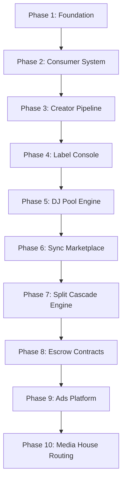

# Intermaven & TuneMavens Comprehensive Development Plan

This development plan integrates the complete platform roadmap, including the 22 remaining dashboard applications and the full architecture for `tunemavens.com`.

---

## 1. Shared Infrastructure Architecture (`intermaven.io` & `tunemavens.com`)
Both portals operate on a unified core stack to ensure credit sharing, user accounts consolidation, and single-source updates:
- **Shared Authentication**: JWT tokens generated by `intermaven.io` are valid on `tunemavens.com`.
- **Shared DB & Credits**: Single MongoDB database instance; credits debited for generations on either site pool from the same user balance.
- **EPK Hosting Engine**: Single source of truth. Updates to an artist EPK sync instantly across `intermaven.io`, `tunemavens.com`, and custom domains.

---

## 2. Incomplete App Roadmap (22 Apps Total)

### A. intermaven.io Roadmap (12 Apps)
These apps expand operational capabilities for creators and business users:

1. **Distribution Tracker** (High Priority) — Tracks release metadata, statuses across streaming platforms, and logs ingestion dates.
2. **Hosting Manager** (High Priority) — Integrates with Truehost API to register and manage domain hosting packages directly from settings.
3. **Contract Builder** (Medium Priority) — Generates industry-standard NDA, collaboration, and work-for-hire agreements with customizable clauses.
4. **Press Release AI** (Medium Priority) — Instantly writes news-style press releases optimized for music and business blogs.
5. **Lyric & Hook AI** (Medium Priority) — Generates genre-specific lyrics, rhyme schemes, and hook suggestions based on mood prompts.
6. **Royalty Calculator** (Medium Priority) — Projects earnings across different streaming tiers (Spotify, Apple Music, YouTube) based on raw streams.
7. **Invoice & Payments** (Medium Priority) — Custom invoicing system for design, production, and booking fees, integrated with Pesapal/Stripe.
8. **Tour Manager** (Medium Priority) — Interactive calendar for scheduling show dates, hotels, routing maps, and guest lists.
9. **Merch Designer Brief** (Medium Priority) — Creates creative guidelines and visual specifications for apparel and merchandise production.
10. **Content Calendar** (Low Priority) — Social media scheduler and scheduling suggestions integrated with Social AI.
11. **Grant Finder** (Low Priority) — Database search index of local and international arts grants and funding programs.
12. **M-Pesa POS App** (Low Priority) — Native point-of-sale terminal accepting M-Pesa payments for physical merch tables or ticketing.

### B. tunemavens.com Roadmap (10 Apps)
These apps focus on music ecosystem utilities, sync licensing, and metadata creation:

1. **Sync Brief AI** — Translates scenic visual descriptions into structured playlist search metrics and catalogue pitches.
2. **Mastering Brief AI** — Configures target loudness (LUFS), EQ curves, and references for automated mastering tools.
3. **Artist One-Sheet AI** — Synthesizes press kit data, bio, and catalog stats into a beautiful, printable single-page PDF pitch sheet.
4. **Remix License Generator** — Automates licensing terms for mashups, bootlegs, and vocal stem clearances.
5. **Broadcast Report Formatter** — Compiles playlist statistics into standard formatting ready for broadcast royalties compliance reporting.
6. **Royalty Statement AI** — Parses bulk distributor CSV statements, identifies payout errors, and extracts split schedules.
7. **Release Planner** — Generates marketing checklists, pre-save campaign dates, and pitching timelines.
8. **Music NFT Brief** — Designs metadata formats and smart contract specs for tokenized audio releases.
9. **ISRC Generator** — Generates and registers verified International Standard Recording Codes for audio masters.
10. **Playlist Pitch AI** — Drafts email pitches and submission copy targeted at editorial and independent curators.

---

## 3. tunemavens.com Portal Build (10 Phases)

The development of the music ecosystem portal is structured into ten sequential phases:

### Phase 1 — Foundation & Subdomains
- Set up domain routing for branded subdomains (`djs.`, `labels.`, `producers.`, `mediahouses.`).
- Establish shared JWT verification middleware and unified session recognition.

### Phase 2 — Consumer Audio System
- Integrate web audio player supporting watermarked previews, background streaming, and offline downloads.
- Build onboarding flow for listeners: personal details → preferences → device detection.

### Phase 3 — Creator Pipeline
- Implement multi-step wizard for artists: bio -> catalog upload -> payout settings -> e-sign terms.
- Setup EPK distribution settings allowing cross-platform mirror hosting.

### Phase 4 — Record Label Console
- Build roster directory dashboard for managers.
- Implement catalog bulk CSV uploader with strict metadata schema verification.
- Establish default 50/50 gross net royalty split configurations (editable per artist).

### Phase 5 — DJ Pool Engine
- Create high-quality audio download center (WAV/MP3-320) featuring extended intro/outro edits.
- Build IP Permission Request Engine to log creative clearances for bootlegs and drops.

### Phase 6 — Sync Marketplace
- scene-based AI search engine indexed by moods and visual tags.
- Secure marketplace listing 30-second watermarked tracks.

### Phase 7 — Split Cascade Engine
- Develop database transaction ledger to resolve multi-tier payment splits instantly:
  `Platform Commission -> Label Share -> Artist Split -> Manager Fee -> Investor Recoupment`

### Phase 8 — Escrow & Contract Module
- Integrate milestone-based payment processing.
- Deploy escrow holds for appearance booking fees and upfront sync licensing advances.

### Phase 9 — Ad Injection Platform
- Create sponsorship desk allowing brands to bid on custom playlist sponsorships.
- Wire audio ad campaign manager to serve mid-roll promotions to Free Starter tier listeners.

### Phase 10 — Media House Routing
- Deploy playlist reporting with AI discrepancy validation scanner (flags broadcast reporting mismatch).
- Build media appearance booking module.