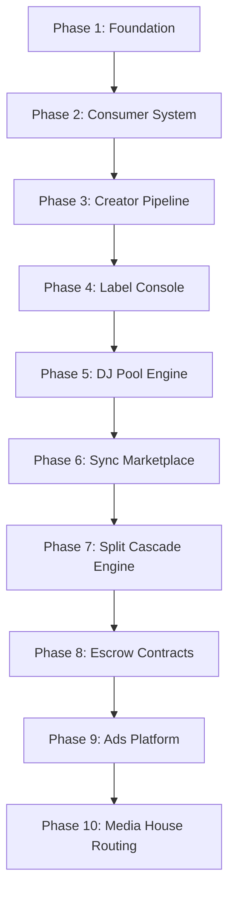

# Intermaven & TuneMavens Comprehensive Development Plan

This development plan integrates the complete platform roadmap, including the 22 remaining dashboard applications and the full architecture for `tunemavens.com`.

**Companion documents:**
- `DOCUMENTATION.md §9` — full technical spec for tunemavens.com (user types, Compensation Engine with 3 publishing tiers + 3 distribution paths, App Marketplace, schema additions).
- `COMPENSATION_AND_CONTRACTS.md` — legal counterpart to the Compensation Engine: 6 contract templates, routing logic, audit-trail requirements, and the rule that no cascade transaction may fire without a signed `contract_id`.

tunemavens.com is positioned as a **comprehensive music business marketplace** — the operating layer for publishing, distribution, sync licensing, and placement across the African music ecosystem and beyond — not merely a streaming/distribution utility.

---

## 1. Shared Infrastructure Architecture (`intermaven.io` & `tunemavens.com`)
Both portals operate on a unified core stack to ensure credit sharing, user accounts consolidation, and single-source updates:
- **Shared Authentication**: JWT tokens generated by `intermaven.io` are valid on `tunemavens.com`.
- **Shared DB & Credits**: Single MongoDB database instance; credits debited for generations on either site pool from the same user balance.
- **EPK Hosting Engine**: Single source of truth. Updates to an artist EPK sync instantly across `intermaven.io`, `tunemavens.com`, and custom domains.

---

## 2. Incomplete App Roadmap (22 Apps Total)

### A. intermaven.io Roadmap (12 Apps)
These apps expand operational capabilities for creators and business users:

1. **Distribution Tracker** (High Priority) — Tracks release metadata, statuses across streaming platforms, and logs ingestion dates.
2. **Hosting Manager** (High Priority) — Integrates with Truehost API to register and manage domain hosting packages directly from settings.
3. **Contract Builder** (Medium Priority) — Generates industry-standard NDA, collaboration, and work-for-hire agreements with customizable clauses.
4. **Press Release AI** (Medium Priority) — Instantly writes news-style press releases optimized for music and business blogs.
5. **Lyric & Hook AI** (Medium Priority) — Generates genre-specific lyrics, rhyme schemes, and hook suggestions based on mood prompts.
6. **Royalty Calculator** (Medium Priority) — Projects earnings across different streaming tiers (Spotify, Apple Music, YouTube) based on raw streams.
7. **Invoice & Payments** (Medium Priority) — Custom invoicing system for design, production, and booking fees, integrated with Pesapal/Stripe.
8. **Tour Manager** (Medium Priority) — Interactive calendar for scheduling show dates, hotels, routing maps, and guest lists.
9. **Merch Designer Brief** (Medium Priority) — Creates creative guidelines and visual specifications for apparel and merchandise production.
10. **Content Calendar** (Low Priority) — Social media scheduler and scheduling suggestions integrated with Social AI.
11. **Grant Finder** (Low Priority) — Database search index of local and international arts grants and funding programs.
12. **M-Pesa POS App** (Low Priority) — Native point-of-sale terminal accepting M-Pesa payments for physical merch tables or ticketing.

### B. tunemavens.com Roadmap (10 Apps)
These apps focus on music ecosystem utilities, sync licensing, and metadata creation:

1. **Sync Brief AI** — Translates scenic visual descriptions into structured playlist search metrics and catalogue pitches.
2. **Mastering Brief AI** — Configures target loudness (LUFS), EQ curves, and references for automated mastering tools.
3. **Artist One-Sheet AI** — Synthesizes press kit data, bio, and catalog stats into a beautiful, printable single-page PDF pitch sheet.
4. **Remix License Generator** — Automates licensing terms for mashups, bootlegs, and vocal stem clearances.
5. **Broadcast Report Formatter** — Compiles playlist statistics into standard formatting ready for broadcast royalties compliance reporting.
6. **Royalty Statement AI** — Parses bulk distributor CSV statements, identifies payout errors, and extracts split schedules.
7. **Release Planner** — Generates marketing checklists, pre-save campaign dates, and pitching timelines.
8. **Music NFT Brief** — Designs metadata formats and smart contract specs for tokenized audio releases.
9. **ISRC Generator** — Generates and registers verified International Standard Recording Codes for audio masters.
10. **Playlist Pitch AI** — Drafts email pitches and submission copy targeted at editorial and independent curators.

---

## 3. tunemavens.com Portal Build (10 Phases)

The development of the music ecosystem portal is structured into ten sequential phases:



### Phase 1 — Foundation & Subdomains
- Set up domain routing for branded subdomains (`djs.`, `labels.`, `producers.`, `mediahouses.`).
- Establish shared JWT verification middleware and unified session recognition.

### Phase 2 — Consumer Audio System
- Integrate web audio player supporting watermarked previews, background streaming, and offline downloads.
- Build onboarding flow for listeners: personal details → preferences → device detection.

### Phase 3 — Creator Pipeline
- Implement multi-step wizard for artists: about/payment/type → details/bio/gallery → discography/products → **Publishing & Distribution election** (3-tier publishing, 3-path distribution — see Phase 7) → **App Marketplace recommendation step** (see Phase 7.5) → compensation matrix → e-sign → dashboard.
- Setup EPK distribution settings allowing cross-platform mirror hosting.
- Add `dashboard_layout: Object` field to `users` collection for per-user custom panel ordering (decoupled from `users.apps[]` activation list).

### Phase 4 — Record Label Console
- Build roster directory dashboard for managers.
- Implement catalog bulk CSV uploader with strict metadata schema verification.
- Establish default 50/50 gross net royalty split configurations (editable per artist).
- Wire labels into the **Distribution Path C (Label / Catalogue Owner Negotiation)** AI wizard (50/50 opening offer, iterative counter-offer rounds, terms persisted to `distribution_deals.negotiation_history`).

### Phase 5 — DJ Pool Engine
- Create high-quality audio download center (WAV/MP3-320) featuring extended intro/outro edits.
- Build IP Permission Request Engine to log creative clearances for bootlegs and drops.

### Phase 6 — Sync Marketplace
- scene-based AI search engine indexed by moods and visual tags.
- Secure marketplace listing 30-second watermarked tracks.

### Phase 7 — Split Cascade Engine (Compensation Engine)
Develop database transaction ledger to resolve multi-tier payment splits instantly:
`Platform Commission → Label/Publisher Share → Artist Split → Manager Fee → Investor Recoupment`

The cascade engine is **deal-type-agnostic at the transaction layer** — order is fixed — but percentage configuration and recoupment stack vary per revenue category. Every configuration is stored as a versioned record attached to the relevant contract (never as a global constant). See `DOCUMENTATION.md §9.3` for the full spec.

**7.1 Publishing — three configurations (`publishing_deals` collection)**
- **A. Standard Administration** — 50/50 publisher's share, writer's share retained by songwriter, administration-only (no pitching obligation).
- **B. Full-Service Co-Publishing** — publisher's share split 50/50 between collective publishers (Tunemavens + named partner) vs. creator's publisher-side interest; active pitching obligation; optional writer/production credit share tracked per-work; recoupables itemised.
- **C. Catalogue Acquisition / Advance** — 100% of net receipts recoup against outstanding balance until cleared; reversion terms documented per deal.

**7.2 Distribution — three paths (`distribution_deals` collection)**
- **A. Standard (Fee-Matched, flat fee)** — service fee only, creator retains 100% of DSP royalties. Must never be conflated with rev-share path.
- **B. Tunemavens Native (Revenue Share)** — 45/55 in Tunemavens' favour, admin-editable per artist/release (always backed by a signed amendment, never unilateral).
- **C. Label / Catalogue Owner Negotiation** — AI wizard opens at 50/50, iterates counter-offer rounds until both parties lock terms; full negotiation history persisted.

**7.3 Recoupment ledger (`catalogue_acquisitions` collection)**
- Applies across Publishing and Distribution paths.
- Gross Receipts → Recoupment Balance (if any) → Standard Cascade.
- Deal-specific, no cross-collateralisation unless contract explicitly states otherwise.
- Real-time remaining-balance reporting exposed to rights holders.

**7.4 Schema additions** — new collections `publishing_deals`, `distribution_deals`, `catalogue_acquisitions`; new field `users.dashboard_layout`. Full schema in `DOCUMENTATION.md §9.7`.

**7.5 Intermaven App Marketplace cross-portal integration (`DOCUMENTATION.md §9.6`)**
- All intermaven.io apps appear as togglable cards inside the tunemavens.com dashboard — no separate login.
- Activation toggle writes to existing `users.apps[]` (no schema change needed for activation).
- Onboarding wizard runs an **app recommendation engine** based on user answers (e.g. touring artist → Tour Manager + Merch Designer Brief; sync-focused artist → Sync Pitch AI + Sync Brief AI). Recommendations are suggestions only — no auto-activation.
- Per-user dashboard layout is custom and editable (uses new `users.dashboard_layout: Object` field, separate from `apps[]`).

### Phase 8 — Escrow & Contract Module
- Integrate milestone-based payment processing.
- Deploy escrow holds for appearance booking fees and upfront sync licensing advances.

**8.1 Contract Creation System (`COMPENSATION_AND_CONTRACTS.md`)**
The Contract Creation System is the legal counterpart of the Phase 7 Compensation Engine. Every compensation configuration must produce a corresponding signed contract before any cascade transaction is permitted to fire. The cascade is **code-gated** to refuse any deal lacking a signed `contract_id`.

**8.2 Template families (6 templates total)**
- **Publishing**: 2.1 Standard Administration · 2.2 Full-Service Co-Publishing (+ Work-Specific Writer/Production Addendum when applicable) · 2.3 Catalogue Acquisition / Advance.
- **Distribution**: 3.1 Standard Flat-Fee · 3.2 Native Revenue Share · 3.3 Label / Catalogue Owner Negotiated (+ Negotiation History Schedule auto-attached).

**8.3 Routing logic**
```
IF deal_type == "publishing":
    standard_admin       → Template 2.1
    full_service_copub   → Template 2.2 (+ writer/production addendum if applicable)
    catalogue_acquisition→ Template 2.3
IF deal_type == "distribution":
    standard_fee_matched → Template 3.1
    tunemavens_native    → Template 3.2
    label_negotiated     → Template 3.3 (+ negotiation history schedule)
```

**8.4 Required behaviour**
- All percentage and recoupment figures pulled **live from the deal record**, never from static template defaults — signed document must reflect actual configured terms.
- After e-signature, contract stored and `contract_id` written back to the deal record, unlocking it for the Compensation Engine.
- **Audit trail per contract** (immutable ledger from §9.3): downloadable signed contract, real-time recoupment balance, full cascade payment history, negotiation history (where applicable).

### Phase 9 — Ad Injection Platform
- Create sponsorship desk allowing brands to bid on custom playlist sponsorships.
- Wire audio ad campaign manager to serve mid-roll promotions to Free Starter tier listeners.

### Phase 10 — Media House Routing
- Deploy playlist reporting with AI discrepancy validation scanner (flags broadcast reporting mismatch).
- Build media appearance booking module.

---

## 4. Platform-Wide Phases (Intermaven Mother Platform)

### Phase 9 — SEO Management Module (Admin-only)
- Backend-driven admin SEO control center (`/admin/seo`).
- Global meta defaults, per-page overrides, sitemap.xml + robots.txt generators.
- Social media account registry for org schema.org `sameAs` + JSON-LD generation (Organization, WebSite, BreadcrumbList, Article, FAQPage, Product, SoftwareApplication, LocalBusiness).
- Tracking & analytics pixel manager (GA4, GTM, Meta, TikTok, LinkedIn, PostHog) with consent-aware loading.
- AI-assisted meta copy generation via Claude Sonnet 4.5.
- Full SEO audit pass executed during this phase.
- Performance dashboards (Core Web Vitals, Lighthouse score targets, broken-link reports, alt-text checks).

### Phase 10 — Mother-CMS (port from Atlanta TV Mount Pro, elevated)
- Region-aware + portal-aware content management.
- Schema: `cms_keys` with default value + per-region overrides + per-portal overrides + version history.
- Endpoints: `GET /api/cms/{key}?region=US&portal=business`, bulk lookup, admin PUT with auto-versioning, rollback, history.
- Migration: all phone numbers, addresses, social handles, M-Pesa callouts move into CMS.
- Atlanta TV Mount Pro becomes the **first consumer** of the Intermaven Mother-CMS — proof of multi-portal architecture.

#### Phase 10 — Mother-CMS as flagship differentiator (positioning / marketing)
Beyond infrastructure, Mother-CMS is positioned as a **standalone product feature**:

- **Tagline**: *"One source of truth. Every portal. Every region. Every language."*
- **Landing-page section** + dedicated `/cms` page with animated diagram showing one CMS pushing copy to intermaven.io, tunemavens.com, hospitality.intermaven.io, atltvmountpro.com simultaneously.
- **Three pillars marketing**: Region-aware · Portal-aware · Audit-ready (versioning + rollback).
- **Pricing tier inclusion**:
  - Creator tier: Mother-CMS access for up to 3 portals
  - Pro tier: unlimited portals + API access for white-label / agency resale
- **Comparison page**: "Intermaven CMS vs Webflow vs Contentful vs Sanity" emphasizing the region/portal-aware angle (a unique differentiator competing products lack).
- **Enterprise sales angle**: agencies, franchise networks, multi-brand operators, hotel groups — all reachable once CMS is positioned as a product not infrastructure.
- **Documentation deliverables** when Phase 10 ships: `/docs/cms-overview.md`, `/docs/cms-api.md`, `/cms` marketing page, comparison page, atltvmountpro case study.
- See **DOCUMENTATION.md §14** for full Mother-CMS spec including schema, API surface, and rollout plan.

---

## 5. Native Mobile Apps & Backend Deployment Architecture

### 5.1. Native Mobile App Roadmap
The platform will support **three (3) distinct mobile application packages**, leveraging hybrid wrappers (like Capacitor) to compile web components into native iOS and Android versions:
1. **TuneMavens Consumer App**: High-fidelity web player wrapper with offline audio caching, playlist controls, and direct tip integrations.
2. **Creator Companion App**: Mobile metrics dashboard allowing creators and managers to check split ledgers and strategy playbooks on the go.
3. **M-Pesa POS App**: Portable Point of Sale checkout app for labels to process ticket scans and merchandise sales at live events.

### 5.2. Database Architecture (MongoDB Atlas)
MongoDB is designated as the core transactional and document database:
- **Flexible Schemas**: Ideal for the Mother-CMS overrides (per-region/per-portal) and conversational strategy plans without DB migration lockups.
- **Transactional Consistency**: Utilizes MongoDB Atlas atomic updates (`$inc`, `$push`) and session transactions to ensure credit pools and split schedules execute with strict ledger consistency.

### 5.3. Backend Hosting Strategy (PaaS vs. Self-Hosted)
- **Phase 1-4 (Launch & Beta)**: Deploy the shared Python FastAPI backend cluster on **Render / Railway (PaaS)** for zero-ops updates and seamless staging.
- **Phase 5+ (Scale)**: Migrate the media streaming and database assets to dedicated **VPS droplets / AWS EC2** to reduce audio bandwidth costs and allow low-level utilities (FFmpeg/Sox) tuning.